# Stereo Vision

## Problem Statement
In the context of drone deliveries, it is crucial not only to detect obstacles in ```real-time``` but also to accurately determine their ```distances```. However, the implementation of traditional ```LiDAR``` sensors on drones poses a significant challenge due to their ```high cost``` and ```weight```. The expense and heaviness of LiDAR systems hinder their practicality for integration onto drones for ```obstacle detection``` and ```distance estimation``` purposes. Consequently, an alternative solution is needed to overcome these limitations and enable drones to ```avoid obstacles```, ```plan optimal paths```, and gain a comprehensive understanding of the surrounding environment. Addressing the problem of acquiring accurate obstacle distance measurements becomes essential in providing a cost-effective and lightweight alternative to LiDAR sensors, ensuring the safe and efficient implementation of drone deliveries.

## Abstract
This project presents an economical alternative to LiDAR sensors for ```per-pixel depth estimation``` in drone applications. By utilizing ```block matching``` and ```Semi-Global Block Matching (SGBM)``` algorithms, we showcase how stereo computer vision techniques can accurately determine depth information. The block matching algorithm efficiently establishes ```correspondences``` between stereo camera images, while the SGBM algorithm optimizes the ```disparity map``` estimation process. 

## Dataset
For this project, the [KITTI dataset](https://www.cvlibs.net/datasets/kitti/eval_object.php?obj_benchmark=3d) will be utilized, specifically the stereo camera images. The dataset includes a comprehensive [3D object detection benchmark](https://www.cvlibs.net/datasets/kitti/raw_data.php), comprising ```7,481``` training images and ```7,518``` test images. These images are accompanied by corresponding point clouds, providing a total of ```80,256``` labeled objects for analysis. Additionally, the ```synchronized and rectified raw data``` from the KITTI dataset will be employed during the **inference** stage of the project, further enhancing the accuracy and reliability of the results. The availability of this rich dataset enables thorough exploration and evaluation of the proposed methods and ensures robustness in the project's findings.

## Plan of Action
1. [Linear Camera Model](#lcm)
2. [Intrinsic and Extrinsic Parameters](#ie)
3. [Simple Stereo](#ss)
4. [Application of Simple Stereo](#ass)


------------------

<a name="lcm"></a>
## 1. Linear Camera Model
Before proceeding, we need to develop a method to estimate the camera's internal and external parameters accurately. This requires creating a linear camera model, which simplifies the estimation process compared to nonlinear models.

In the image below, we have a point ```P``` in the world coordinates ```W``` and the camera with its own coordinates ```C```. If we know the relative position and orientation of the camera coordinate frame with respect to the world coordinates frame, then we can write an expression that takes us all the way from the point ```P``` in the world coordinate frame to its projection ```P'``` onto the image plane. That complete mapping is what we refer to as the ```forward imaging model```.

<div align="center">
  <!-- file image -->
  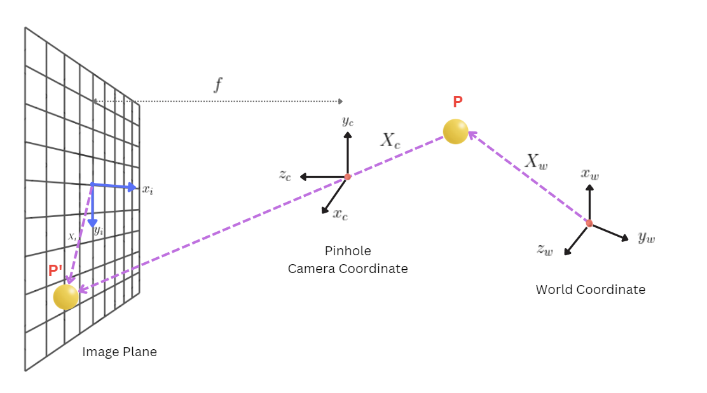
</div>


<div align="center">
  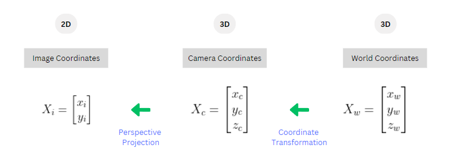
    <p><b> Fig 1. Forward Imaging Model: 3D to 2D </b></p>
</div>

### 1.1 Mapping of Camera Coordinates to Image Coordinates (3D to 2D)

#### 1.1.1 Image Plane to Image Sensor Mapping
We assume that the point has been defined in the camera coordinate frame and using ```perspective projection equations```:

<div align="center">
  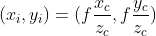
</div>

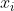 and 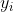 are the coordinates of point ```P``` onto the image plane and ```f``` is the focal length which is the distance between the Centre of Projection (COP) and the image plane of the camera.

We have assumed we know the coordinates of the image plane in terms of **millimeters (mm)** which is the same unit in the camera coordinate frame. However, in reality we have an image sensor whose units are **pixels (px)**. Hence, we need to convert our coordinate of ```P``` from mm to pixel coordinates using **pixel densities (pixels/mm)**.

<div align="center">
  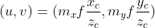
</div>

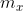 and 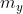 are the pixel densities (px/mm) in the x and y directions respectively.

Since now we treated the midpoint of the image plane as the origin but generally, we treat the top-left corner as the origin of the image sensor. 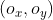 is the **Principle Point** where the optical axis pierces the sensor.

<div align="center">
  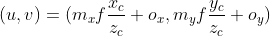
</div>

We re-write the equation above whereby 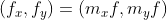 are the focal lengths in pixels in the x and y directions:

<div align="center">
  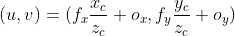
</div>


- 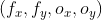: **Intrinsic parameters** of the camera.
- They represent the camera's **internal geometry**.
- The equation tells us that objects **farther** away appear **smaller** in the image.
- ```(u,v)``` are **non-linear models** as we are dividing by ```z```.


#### 1.1.2 Homogeneous Coordinates
We need to go from a ```non-linear``` model to a ```linear``` model and we will use homogeneous coordinates to do so. we will transform ```(u,v)``` from **pixel** coordinates to **homogeneous** coordinates.

The homogeneous representation of a 2D point 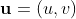
 is a 3D point 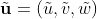. The third coordinate 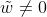 is fictitious.

<div align="center">
  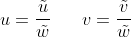
</div>

Similarly, we multiply the equation below by 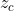
: 

<div align="center">
  
</div>

We now have a ```3 x 4``` matrix which contains all the internal parameters of the camera multiplied by the homogeneous coordinates of the 3-dimensional point ```P``` defined in the camera coordinate frame. This gives us a **Linear Model for Perspective Projection**.

<div align="center">
  
</div>

Note that this ```3 x 4``` matrix is called the **Intrinsic Matrix**:

<div align="center">
  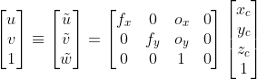
</div>

<div align="center">
  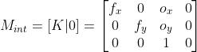
</div>

Its structure is an upper-right triangular matrix which we can separate as ```K```:

<div align="center">
  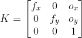
</div>

Hence, we have 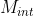 that takes us from the homogeneous coordinate representation of a point in the camera coordinate frame 3D to its pixel coordinates in the image, 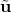.


<div align="center">
  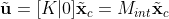
</div>


### 1.2 Mapping of World Coordinates to Camera Coordinates (3D to 3D)
Now we need the mapping of a point from the ```world``` coordinates to the ```camera``` coordinates: 3D to 3D. That can be done by using the **position**, 
 and **orientation**, ```R```,  of the camera coordinate frame. The position and orientation of the camera in the world coordinate frame ```W``` are the camera's **Extrinsic Parameters**.

<div align="center">
  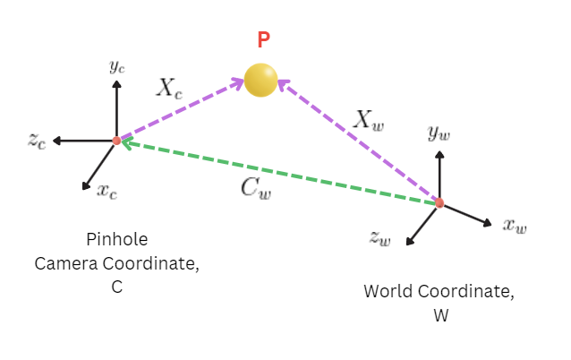
</div>

Orientation or Rotation matrix R is **orthonormal**: 

<div align="center">
  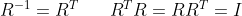
</div>


If we now map ```P``` from the word coordinate frame to the camera coordinate frame **rotation** matrix ```R``` and **translation** matrix ```t```:

<div align="center">
  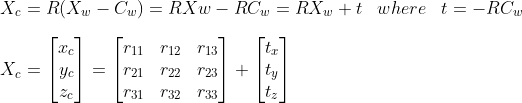
</div>


We can write the equation above using homogeneous coordinates:

<div align="center">
  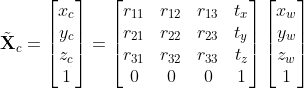
</div>

The **Extrinsic Matrix** is the ```4 x 4``` matrix:

<div align="center">
  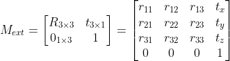
</div>

And this is how we transformed a point from the world coordinates frame to the camera coordinates frame:

<div align="center">
  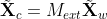
</div>

#### 1.2.1 Projection Matrix
We now have our mapping from world to camera using the **Extrinsic Matrix**:

<div align="center">
  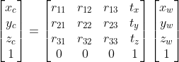
</div>

<div align="center">
  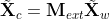
</div>


And the mapping of the camera to the image using the **Intrinsic Matrix**:

<div align="center">
  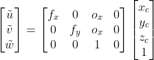
</div>

<div align="center">
  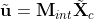
</div>

Therefore, we can combine these two to get a direct mapping from a point in the world coordinate frame to a pixel location in the image:

<div align="center">
  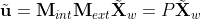
</div>

We then have a ```3 x 4``` matrix called the **Projection Matrix**:

<div align="center">
  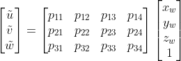
</div>

Hence, if we wish to calibrate the camera, all we need to know is the **projection matrix**.  We can then go from any point in 3D to its projection in pixels in the image.

<div align="center">
  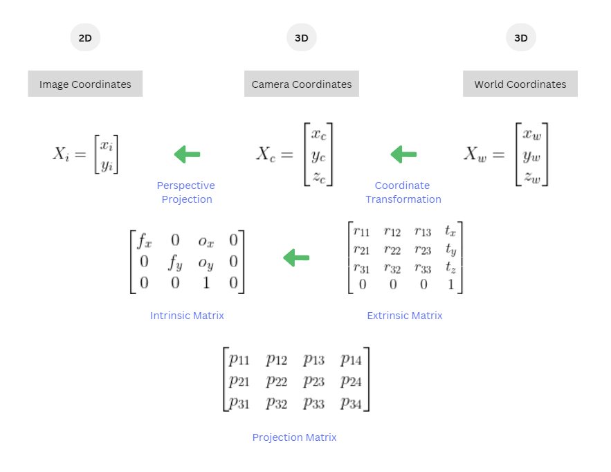
</div>


----

<a name="ie"></a>
## 2. Intrinsic and Extrinsic Parameters
By employing our calibration method, we are able to achieve a precise estimation of the projection matrix. we can also go beyond this step by decomposing the projection matrix into its constituent parts: the ```intrinsic matrix```, encompassing all ```internal parameters```, and the ```extrinsic matrix```, which captures the ```external parameters``` of the camera.

<div align="center">
  
</div>

Now if we check how we get the first 3 columns of the projection matrix, we get it by multiplying the **calibration matrix, K** with the **rotation matrix, R**. Note that ```K``` is an **upper-right triangular matrix** and ```R``` is an **orthonormal matrix**, hence, it is possible to uniquely "decouple" ```K``` and ```R``` from their product using ```QR factorization method```.

<div align="center">
  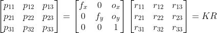
</div>

Similarly, to get the last column of the projection matrix, we multiply the **calibration matrix, K** with the **translation vector, t**:

<div align="center">
  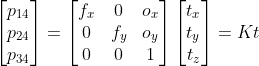
</div>

Therefore:

<div align="center">
  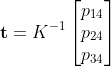
</div>


Note that pinholes do not exhibit distortions but lenses do. We may encounter **radial** or **tangential** distortion and these are non-linear effects. And in order to take care of these, we need to incorporate the distortion coefficients in our intrinsic model.

--------------- 

<a name="ss"></a>
## 3. Simple Stereo
Now we want to recover a 3-Dimensional structure of a scene from two images. Before we dive into this, let's ask ourselves, given a calibrated camera, can we find the 3D scene point from a sinple 2D image? The answer is **no**. But we do know that the corresponding 3D point must lie on an ```outgoing ray``` shown in green and given that the camera is calibrated, we know the equation of this ray.

<div align="center">
  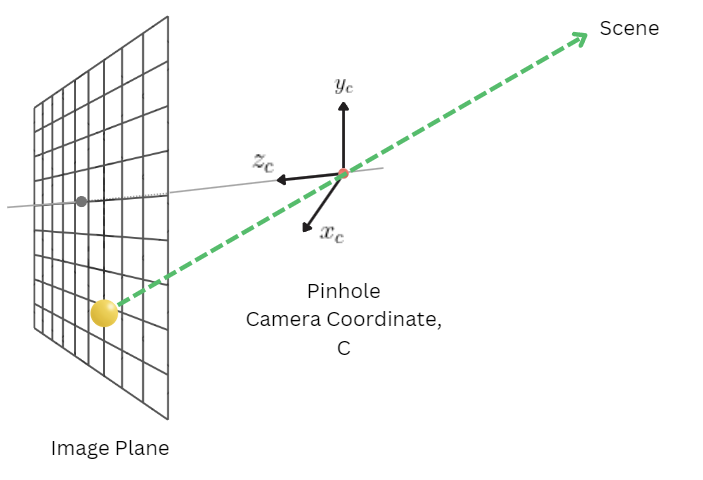
</div>

So in order to reconstruct a 3D scene, we need two images captured from two different locations. Below is an example of a stereo camera whereby we have a **left camera** and a **right camera**, and the right camera is simply identical to the left camera but displaced along the horizontal direction by a distance ```b``` called the ```baseline```.

In the image below we have the projection of a scene point in the left camera and the projection of the same point in the right camera. We shoot out two rays from the projected points and wherever those two rays intersect is where the physical point lies corresponding to these two image points. This is called **triangulation** problem.

<div align="center">
  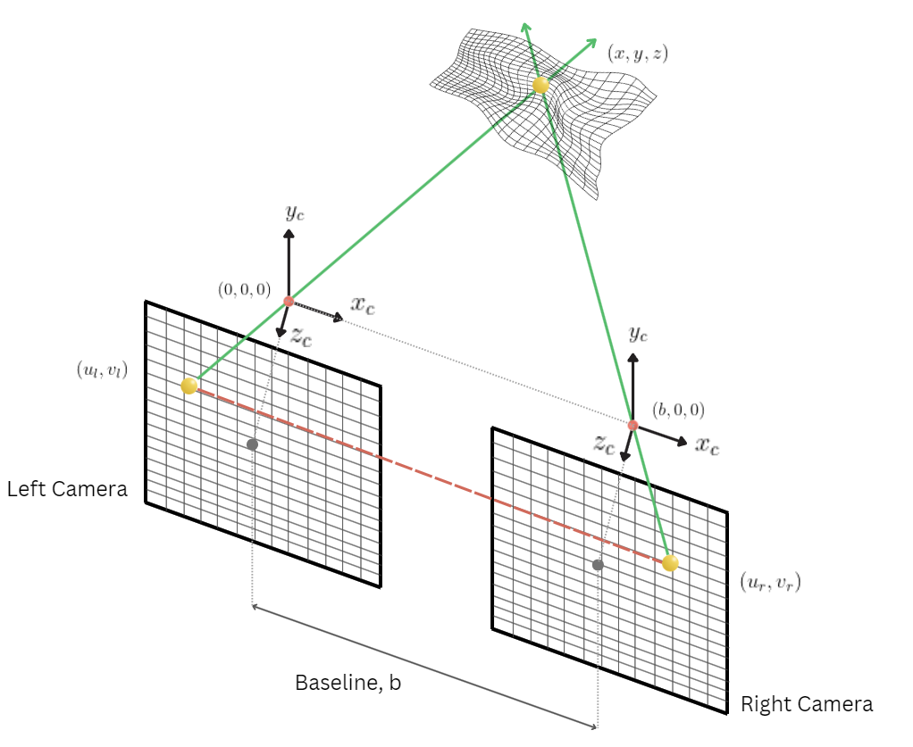
</div>

Assuming we know the position of the point in the left and right image plane then we have the 2 equations based on the perspective projection equation:

<div align="center">
  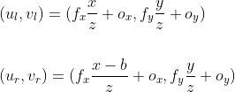
</div>

Notice that the position of the point in the vertical direction of the image plane is the same for both the left and right camera meaning we have **no disparity** in the vertical direction. Hence solving for ```(x,y,z)```:


<div align="center">
  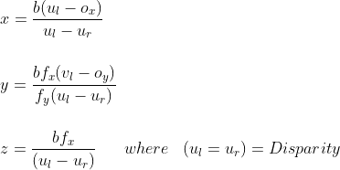
</div>

- **Disparity** is the **difference** in the u-coordinates of the same scene point in the two images.
- Using the disparity we can calculate the **depth** ```z``` of the point in the scene.
- **Depth** ```z``` is **inversely proportional** to the **disparity**. That is, if a point is very close to the camera, it will have a big disparity. On the other hand, if a point is far from the camera, it will have a small disparity.
- The **disparity** is **zero** if a point is at **infinity**, that is, at infinity a point will have the same exact position on the left and right image plane.
- **Disparity** is **proportional** to **baseline**, that is, the further apart are the two cameras, the greater the disparity will be.
- When designing a stereo system, we want to use a stereo configuration where the **baseline is large**, as the larger the baseline, the more precise we can make the disparity measurements.

### 3.1 Stereo Matching

Since now we have assumed we know where a point of the left image lands on the right image. That is, we assumed we knew the **correspondence** between points in the left and right image.
Now we need to find that correspondence and that is called **stereo matching**.

As mentioned before, we do NOT have disparity in the vertical direction, which means that the corresponding points must lie on the same ```horizontal line``` in both images. Hence, our search is ```1D``` and we can use ```template matching``` to find the corresponding point in the right image.


<div align="center">
  
</div>

- We use the window ```T``` as a template and match it with all the windows along the same scan line ```L``` in the right image using a similarity metric (e.g., ```sum of absolute differences```, ```sum of squared differences```).
- The point where it matches best (where the error is lowest) is the match.
- That point is the correspondence that we use to estimate disparity.

Now we want to know how big the window ```T``` should be:
- If the window is very small, we may get good localization but **high-sensitivity noise**. The smaller the window, the less descriptive the pattern is.
- If we use a large window, we may get more robust matches in terms of depth of values but the disparity map is going to be more blurred: **poor localization**.
- Another method could be to use the **adaptive window method**: For each point, we match points using windows of multiple sizes and use the disparity that is a result of the best similarity measure.

Stereo-matching algorithms can be categorized as either ```local``` or ```global``` methods, depending on how they handle the disparity optimization step. 

- Global methods incorporate a **pairwise smoothness** term in the cost function, which encourages spatial continuity across pixels and consistent assignments along edges. 
- These global methods generally perform better than local methods in handling object boundaries and resolving ambiguous matches.
- Global optimization problems are often computationally challenging and can be classified as NP-hard.
- On the other hand, local methods have simpler computations but may struggle with object boundaries and ambiguous matches.


### 3.2 Issues with Stereo Matching

In order to get a good stereo matching, we want to avoid the following:

1. We expect the surface to have **texture**. If we have the image of a smooth wall, then we do not have much texture and if we take a small window ```T``` then we may get many matches between the left and right image.
2. If we do have texture in our image, then this texture should not be **repetitive**. If we have a repetitive pattern we will get multiple matches in the right image where they are all going to be perfectly good matches.
3. An inherent problem of stereo matching is **foreshortening** whereby the projected area of our window onto the left image is different from the projected area in the right image. Hence, we are not matching the same brightness patterns but a warped or distorted version of it.

------------

<a name="ass"></a>
## 4. Application of Simple Stereo
Now we will try to find the distances of objects using the KITTI Dataset. For that, we first need to know the configuration of the cameras on the autonomous car. Thankfully, we have a  very detailed explanation describing the position and the baseline between the cameras as shown below.

<div align="center">
  
</div>

When downloading the dataset for 3D Object Detection, we have the following files:

- **Left Images**
- **Right Images**
- **Calibration Data**
- **Labels**

### 4.1 Extract Projection Matrix
Below is an example of how the calibration data is. Since we are using left and right color images, we need to extract ```P2``` and ```P3``` to get the projection matrices.

Note that we get a left and right projection matrix:

```python
Left P Matrix
[[     721.54           0      609.56      44.857]
 [          0      721.54      172.85     0.21638]
 [          0           0           1   0.0027459]]

Right P Matrix
[[     721.54           0      609.56     -339.52]
 [          0      721.54      172.85      2.1999]
 [          0           0           1   0.0027299]]

RO to Rect Matrix
[[    0.99992   0.0098378   -0.007445]
 [ -0.0098698     0.99994  -0.0042785]
 [  0.0074025   0.0043516     0.99996]]

```
Next, we need to extract the **Intrinsic Matrix** and the **Extrinsic Matrix** from our **Projection Matrix**. Recall from the equation below:

<div align="center">
  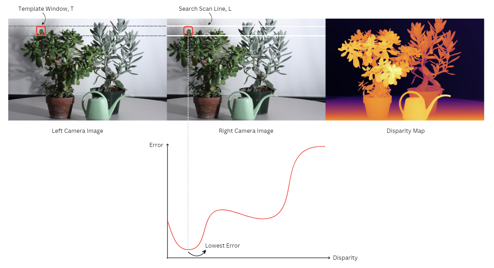
</div>

We will use OpenCV's ```decomposeProjectionMatrix``` function for that:

```python
def decompose_projection_matrix(projection_matrix):
    """
    Decompose a projection matrix into camera matrix, rotation matrix, and translation vector.

    Args:
        projection_matrix (numpy.ndarray): 3x4 projection matrix.

    Returns:
        tuple: Tuple containing the decomposed components:
            - camera_matrix (numpy.ndarray): Camera matrix. [ fx   0   cx ]
                                                            [  0  fy   cy ]
                                                            [  0   0    1 ]
            - rotation_matrix (numpy.ndarray): Rotation matrix.
            - translation_vector (numpy.ndarray): Translation vector.
    """

    # Decompose the projection matrix
    camera_matrix, rotation_matrix, translation_vector, _, _, _, _ = cv2.decomposeProjectionMatrix(projection_matrix)
    translation_vector = translation_vector/translation_vector[3]
    # Return the decomposed components
    return camera_matrix, rotation_matrix, translation_vector
```

Below is what we get:

```python
Camera Matrix Left:
[[     721.54           0      609.56]
 [          0      721.54      172.85]
 [          0           0           1]]

Rotation Matrix Left:
[[          1           0           0]
 [          0           1           0]
 [          0           0           1]]

Translation Vector Left:
[[  -0.059849]
 [ 0.00035793]
 [ -0.0027459]
 [          1]]

Camera Matrix Right:
[[     721.54           0      609.56]
 [          0      721.54      172.85]
 [          0           0           1]]

Rotation Matrix Right:
[[          1           0           0]
 [          0           1           0]
 [          0           0           1]]

Translation Vector Right:
[[    0.47286]
 [  -0.002395]
 [ -0.0027299]
 [          1]]
```
Observe how the Rotation Matrix is just an **Identity Matrix**. We need to extract the **Focal Length** from the **Intrinsic Matrix** and calculate the **baseline** from the **translation vectors** as such:

```python
    # Extract the focal length and baseline
    focal_length_x = camera_matrix_right[0, 0]
    focal_length_y = camera_matrix_right[1, 1]
    baseline = abs(translation_vector_left[0] - translation_vector_right[0])
```

Output:

```python
Focal Length (x-direction): 721.5377

Focal Length (y-direction): 721.5377

Baseline: [    0.53271] 
```

Observe the baseline is ```0.53271``` m same as on the configuration on the autonomous car.


### 4.3 Display Left and Right Images

We start by displaying the right and left images of the KITTI dataset. Note that since the baseline is ```54 cm``` which is quite large compared to the OAK-D stereo cameras, we will have a greater disparity hence, it will be more accurate to calculate the depth map.

<div align="center">
  
</div>


### 4.4 Compute Disparity Map

Next, we will use OpenCV's **Block Matching** function (```StereoBM_create```) and **Semi-Global Block Matching** function (```StereoSGBM_create```) to calculate the **disparity**. We will need to fine-tune some parameters: ```num_disparities```, ```block_size```, and ```window_size```.

```python
def compute_disparity(left_img, right_img, num_disparities=6 * 16, block_size=11, window_size=6, matcher="stereo_sgbm", show_disparity=True):
    """
    Compute the disparity map for a given stereo-image pair.

    Args:
        image (numpy.ndarray): Left image of the stereo pair.
        img_pair (numpy.ndarray): Right image of the stereo pair.
        num_disparities (int): Maximum disparity minus minimum disparity.
        block_size (int): Size of the block window. It must be an odd number.
        window_size (int): Size of the disparity smoothness window.
        matcher (str): Matcher algorithm to use ("stereo_bm" or "stereo_sgbm").
        show_disparity (bool): Whether to display the disparity map using matplotlib.

    Returns:
        numpy.ndarray: The computed disparity map.
    """
    if matcher == "stereo_bm":
        # Create a Stereo BM matcher
        matcher = cv2.StereoBM_create(numDisparities=num_disparities, blockSize=block_size)
    elif matcher == "stereo_sgbm":
        # Create a Stereo SGBM matcher
        matcher = cv2.StereoSGBM_create(
            minDisparity=0, numDisparities=num_disparities, blockSize=block_size,
            P1=8 * 3 * window_size ** 2, P2=32 * 3 * window_size ** 2,
            mode=cv2.STEREO_SGBM_MODE_SGBM_3WAY
        )

    # Convert the images to grayscale
    left_gray = cv2.cvtColor(left_img, cv2.COLOR_BGR2GRAY)
    right_gray = cv2.cvtColor(right_img, cv2.COLOR_BGR2GRAY)

    # Compute the disparity map
    disparity = matcher.compute(left_gray, right_gray).astype(np.float32) / 16


    if show_disparity:
        # Display the disparity map using matplotlib
        plt.imshow(disparity, cmap="CMRmap_r") #CMRmap_r # cividis
        plt.title('Disparity map with SGBM', fontsize=12)
        plt.show()

    return disparity
```
Observe how the disparity using Block Matching is noisier than SGBM. We will use the SGBM algorithm from now on.

<div align="center">
  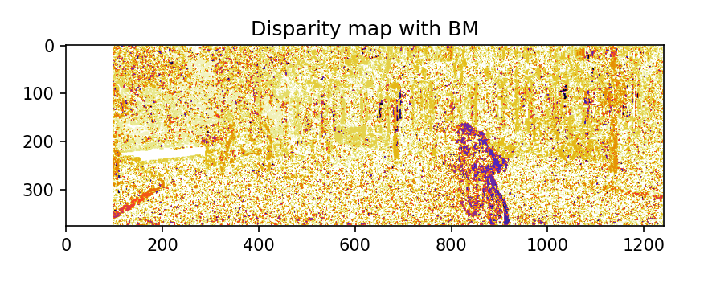 
  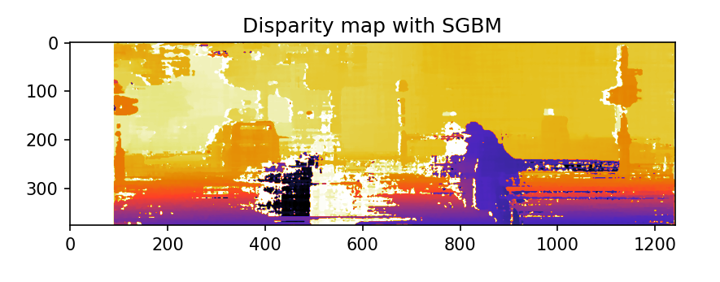
</div>

Note that we have a white strip on the left of the images as there are no features to match from the left image to the right image. This depends on the ```block_size``` parameter.

### 4.5 Compute Depth Map
Next, we will use the **disparity map** to output a **depth map**. We will use the equation below:

<div align="center">
  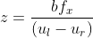
</div>

We take in the **baseline**, **focal length**, and the **disparity map** in order to calculate the depth of each pixel:

```python
def calculate_depth_map(disparity, baseline, focal_length, show_depth_map=True):
    """
    Calculates the depth map from a given disparity map, baseline, and focal length.

    Args:
        disparity (numpy.ndarray): Disparity map.
        baseline (float): Baseline between the cameras.
        focal_length (float): Focal length of the camera.

    Returns:
        numpy.ndarray: Depth map.
    """

    # Replace all instances of 0 and -1 disparity with a small minimum value (to avoid div by 0 or negatives)
    disparity[disparity == 0] = 0.1
    disparity[disparity == -1] = 0.1

    # Initialize the depth map to match the size of the disparity map
    depth_map = np.ones(disparity.shape, np.single)

    # Calculate the depths
    depth_map[:] = focal_length * baseline / disparity[:]

    if show_depth_map:
        # Display the disparity map using matplotlib
        plt.imshow(depth_map, cmap="cividis") #CMRmap_r # cividis
        plt.show()

    return depth_map
```

Our output is a depth map that outputs the depth of each pixel. 


<div align="center">
  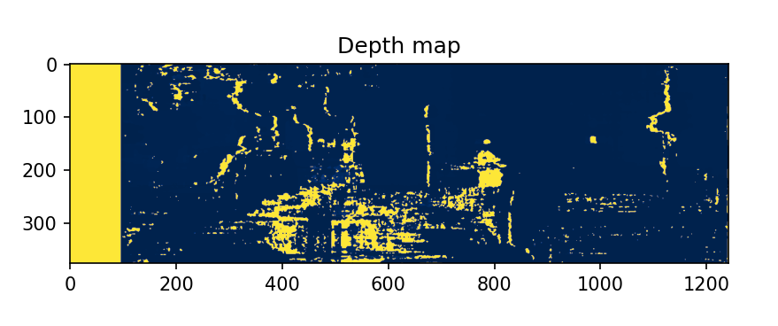
</div>

The depth map represents ```per-pixel depth estimation```. However, we are interested in getting the depth or distances of some specific obstacles such as cars or pedestrians. Hence, we will use an object detection algorithm in order to segment our depth map and get the distances of these objects only.


<video src="https://github.com/user-attachments/assets/9bcc2135-9ebb-4d2a-bedd-2162bbf055bb" controls="controls" style="max-width: 730px;">
</video>


### 4.6 Object Detection
The next step is to use ```YOLOv8``` to detect objects in our frames. We want to get the **coordinates** of the **bounding boxes**.

```python
def get_bounding_box_center_frame(frame, model, names, object_class, show_output=True):

    bbox_coordinates = []
    frame_copy = frame.copy()

    # Perform object detection on the input frame using the specified model
    results = model(frame)

    # Iterate over the results of object detection
    for result in results:

        # Iterate over each bounding box detected in the result
        for r in result.boxes.data.tolist():
            # Extract the coordinates, score, and class ID from the bounding box
            x1, y1, x2, y2, score, class_id = r
            x1 = int(x1)
            x2 = int(x2)
            y1 = int(y1)
            y2 = int(y2)

            # Get the class name based on the class ID
            class_name = names.get(class_id)


            # Check if the class name matches the specified object_class and the detection score is above a threshold
            if class_name in object_class  and score > 0.5:
                bbox_coordinates.append([x1, y1, x2, y2])

                # Draw bounding box on the frame
                cv2.rectangle(frame_copy, (x1, y1), (x2, y2), (0, 255, 0), 2)


    if show_output:
        # Convert frame from BGR to RGB
        frame_rgb = cv2.cvtColor(frame_copy, cv2.COLOR_BGR2RGB)
        # Show the output frame with bounding boxes
        cv2.imshow("Output", frame_rgb)
        cv2.waitKey(0)
        cv2.destroyAllWindows()


    # Return the list of center coordinates
    return bbox_coordinates
```

We decide to detect ```cars```, ```persons```, and ```bicycles``` only.

<div align="center">
  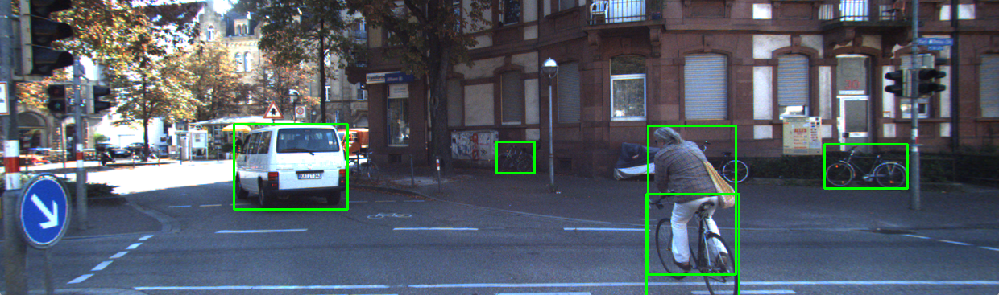
</div>


### 4.7 Distances with Object Detection
Since now we have the **bounding box coordinates** and the **depth map** for each frame, we can use two pieces of data and extract the depth of each obstacle. 

    We get the distance of an obstacle by indexing the depth map using the center of the bounding boxes.

```python
def calculate_distance(bbox_coordinates, frame, depth_map, disparity_map, show_output=True):
    frame_copy = frame.copy()

    # Normalize the disparity map to [0, 255]
    disparity_map_normalized = cv2.normalize(disparity_map, None, 0, 255, cv2.NORM_MINMAX, cv2.CV_8U)

    # Apply a colorful colormap to the disparity map
    colormap = cv2.COLORMAP_JET
    disparity_map_colored = cv2.applyColorMap(disparity_map_normalized, colormap)

    # Normalize the depth map to [0, 255]
    depth_map_normalized = cv2.normalize(depth_map, None, 0, 255, cv2.NORM_MINMAX, cv2.CV_8U)

    # Apply a colorful colormap to the depth map
    colormap = cv2.COLORMAP_BONE
    depth_map_colored = cv2.applyColorMap(depth_map_normalized, colormap)

    for bbox_coor in bbox_coordinates:
        x1, y1, x2, y2 = bbox_coor
        center_x = (x1 + x2) // 2
        center_y = (y1 + y2) // 2

        distance = depth_map[center_y][center_x]
        print("Calculated distance:", distance)

        # Convert distance to string
        distance_str = f"{distance:.2f} m"

        # Draw bounding box on the frame
        cv2.rectangle(frame_copy, (x1, y1), (x2, y2), (0, 255, 0), 2)

        # Draw bounding box on the frame
        cv2.rectangle(disparity_map_colored, (x1, y1), (x2, y2), (0, 255, 0), 2)

        # Draw bounding box on the frame
        cv2.rectangle(depth_map_colored, (x1, y1), (x2, y2), (0, 255, 0), 2)

        # Calculate the text size
        text_size, _ = cv2.getTextSize(distance_str, cv2.FONT_HERSHEY_SIMPLEX, 0.5, 2)

        # Calculate the position for placing the text
        text_x = center_x - text_size[0] // 2
        text_y = y1 - 10  # Place the text slightly above the bounding box

        # Calculate the rectangle coordinates
        rect_x1 = text_x - 5
        rect_y1 = text_y - text_size[1] - 5
        rect_x2 = text_x + text_size[0] + 5
        rect_y2 = text_y + 5

        # Draw white rectangle behind the text
        cv2.rectangle(frame_copy, (rect_x1, rect_y1), (rect_x2, rect_y2), (255, 255, 255), cv2.FILLED)

        # Put text at the center of the bounding box
        cv2.putText(frame_copy, distance_str, (text_x, text_y),
                    cv2.FONT_HERSHEY_SIMPLEX, 0.5, (0, 0, 0), 2, cv2.LINE_AA)

        # Draw white rectangle behind the text
        cv2.rectangle(disparity_map_colored, (rect_x1, rect_y1), (rect_x2, rect_y2), (255, 255, 255), cv2.FILLED)

        # Put text at the center of the bounding box
        cv2.putText(disparity_map_colored, distance_str, (text_x, text_y),
                    cv2.FONT_HERSHEY_SIMPLEX, 0.5, (0, 0, 0), 2, cv2.LINE_AA)

        # Draw white rectangle behind the text
        cv2.rectangle(depth_map_colored, (rect_x1, rect_y1), (rect_x2, rect_y2), (255, 255, 255), cv2.FILLED)

        # Put text at the center of the bounding box
        cv2.putText(depth_map_colored, distance_str, (text_x, text_y),
                    cv2.FONT_HERSHEY_SIMPLEX, 0.5, (0, 0, 0), 2, cv2.LINE_AA)


    if show_output:
        # Convert frame from BGR to RGB
        #frame_rgb = cv2.cvtColor(frame_copy, cv2.COLOR_BGR2RGB)

        # Show the output frame with bounding boxes
        cv2.imshow("Output disparity map", disparity_map_colored)
        cv2.imshow("Output frame", frame_copy)
        cv2.imshow("Output depth map", depth_map_colored)
        cv2.waitKey(0)
        cv2.destroyAllWindows()

    return disparity_map_colored, frame_copy, depth_map_colored
```
We draw the bounding boxes and the distance of the objects from the camera is displayed on top in meters.

<div align="center">
  
</div>

### 4.8 Compare with Ground Truth
We can also compare our prediction of distances with the ```ground truth```. The image on the left(red) is the ground truth whereas the image on the right is our **prediction** using SGBM. We still have a discrepancy of ```0.41 m``` which is still a huge number when it comes to self-driving cars.


<div align="center">
   
  
</div>

In this example, we have a difference of ```0.61 m```.

<div align="center">
  
   
</div>


### 4.9 Pipeline

Finally, we want to create a ```pipeline``` function whereby:

1. We take in all **left** and **right** images
2. Calculate the **disparity**
3. Create a **depth map**
4. Run an **object detection**
5. Display the **distances** with their **bounding boxes**.

```python
def pipeline(left_image, right_image, object_class):
    """
    Performs a pipeline of operations on stereo images to obtain a colored disparity map, RGB frame, and colored depth map.

    Input:
    - left_image: Left stereo image (RGB format)
    - right_image: Right stereo image (RGB format)
    - object_class: List of object classes of interest for bounding box retrieval

    Output:
    - disparity_map_colored: Colored disparity map (RGB format)
    - frame_rgb: RGB frame
    - depth_map_colored: Colored depth map (RGB format)
    """
    global focal_length

    # Calculate the disparity map
    disparity_map = compute_disparity(left_image, right_image, num_disparities=90, block_size=5, window_size=5,
                                      matcher="stereo_sgbm", show_disparity=False)

    # Calculate the depth map
    depth_map = calculate_depth_map(disparity_map, baseline, focal_length, show_depth_map=False)

    # Get bounding box coordinates for specified object classes
    bbox_coordinates = get_bounding_box_center_frame(left_image, model, names, object_class, show_output=False)

    # Calculate colored disparity map, RGB frame, and colored depth map
    disparity_map_colored, frame_rgb, depth_map_colored = calculate_distance(bbox_coordinates, left_image, depth_map, disparity_map, show_output=False)

    return disparity_map_colored, frame_rgb, depth_map_colored

```

Below are the results:


<video src="https://github.com/user-attachments/assets/e05a4084-ae7c-49c1-8bd7-674beabd66be" controls="controls" style="max-width: 730px;">
</video>

  
<video src="https://github.com/user-attachments/assets/3350e737-33cd-41b6-9de8-ff6e4cc93dbf" controls="controls" style="max-width: 730px;">
</video>


<video src="https://github.com/user-attachments/assets/3242c94b-3094-44e1-87f6-a544ee624fec" controls="controls" style="max-width: 730px;">
</video>


## Conclusion
In conclusion, while traditional techniques such as ```Local```, ```Global```, and ```Semi-Global Matching``` algorithms have been employed in this project, the utilization of Deep Learning provides alternative approaches to determining disparity. For example:

- **MC-CNN**: an algorithm that uses Siamese Networks logic to find disparity

- **PSM-Net**: an algorithm that uses Pyramids architectures

- **AnyNet**: an algorithm optimized for mobile

- **RAFT-Stereo**: an optical flow algorithm adapted to Stereo Vision

- **CreStereo** which is compatible with the OAK-D camera

By employing advanced neural networks architectures like MC-CNN, PSM-Net, AnyNet, RAFT-Stereo, and CreStereo, we can achieve more accurate and reliable depth maps, enabling UAVs to better perceive their surroundings. This improved distance estimation is crucial for obstacle detection during UAV package delivery operations. With precise depth perception, UAVs can effectively identify and locate obstacles such as buildings, trees, or other objects that may obstruct their flight path. By leveraging deep learning, UAVs can analyze real-time scenes, enabling them to make informed decisions and adjust their trajectory to avoid potential collisions or navigate complex environments safely.


----------

## References
[1] Mileyan, I. (n.d.). AnyNet. GitHub. [https://github.com/mileyan/AnyNet](https://github.com/mileyan/AnyNet)

[2] Chang, J. R. (n.d.). PSMNet. GitHub. https://github.com/JiaRenChang/PSMNet

[3] Autonomous Vision Group. (n.d.). Unimatch. GitHub. https://github.com/autonomousvision/unimatch

[4] Zhang, M. (2016). Scene Understanding and Mapping in Robotics: Algorithms and System Integration. Massachusetts Institute of Technology. https://groups.csail.mit.edu/commit/papers/2016/min-zhang-meng-thesis.pdf

[5] Eigen, D., Puhrsch, C., & Fergus, R. (2015). Depth Map Prediction from a Single Image using a Multi-Scale Deep Network. arXiv:1510.05970. https://arxiv.org/abs/1510.05970

[6] Kendall, A., & Gal, Y. (2018). What Uncertainties Do We Need in Bayesian Deep Learning for Computer Vision? arXiv:1803.08669. https://arxiv.org/pdf/1803.08669.pdf

[7] Author(s) not specified. (2022). Title not specified. arXiv:2203.11483. https://arxiv.org/abs/2203.11483

[8] Episci Inc. (n.d.). Swarmsense. https://www.episci.com/product/swarmsense/

[9] Skybrush. (n.d.). https://skybrush.io/

[10] ModalAI. (n.d.). https://www.modalai.com/

[11] Climb, D. (n.d.). Projections. GitHub. https://github.com/darylclimb/cvml_project/tree/master/projections

[12] Jain, S. (n.d.). Depth Estimation 1: Basics and Intuition. Towards Data Science. https://towardsdatascience.com/depth-estimation-1-basics-and-intuition-86f2c9538cd1

[13] Author not specified. (n.d.). Uncertainty in Depth Estimation. Towards Data Science. https://towardsdatascience.com/uncertainty-in-depth-estimation-c3f04f44f9

[14] Author not specified. (n.d.). Camera-LiDAR Projection: Navigating between 2D and 3D. Medium. https://medium.com/swlh/camera-lidar-projection-navigating-between-2d-and-3d-911c78167a94

[15] Geiger, A., Lenz, P., & Urtasun, R. (2013). Are we ready for autonomous driving? The KITTI vision benchmark suite. Proceedings of the IEEE Conference on Computer Vision and Pattern Recognition (CVPR), 3354-3361. https://www.mrt.kit.edu/z/publ/download/2013/GeigerAl2013IJRR.pdf

[16] Sevensense Robotics. (n.d.). Monocular 3D Object Detection and Box Fitting Trained End-to-End from Image Labels. [Video file]. https://www.youtube.com/watch?v=AYjgeaQR8uQ&ab_channel=SevensenseRobotics

[17] Author(s) not specified. (2020). Title not specified. arXiv:2007.10743. https://arxiv.org/pdf/2007.10743.pdf
